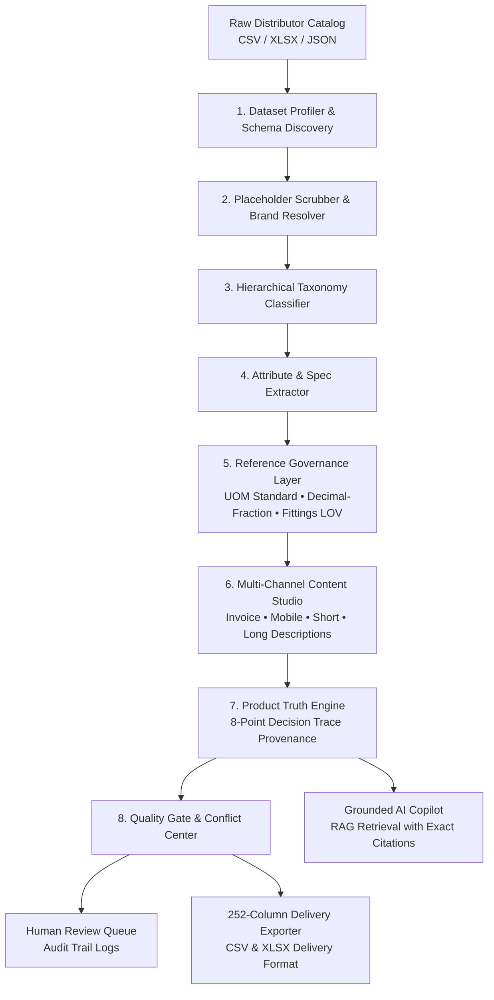

# ANVAYA — Enterprise AI Product Intelligence & Catalog Enrichment Platform

<div align="center">

**Connect Data. Discover Intelligence. Prove Every Fact.**

[](tests/)
[](tests/frontend/)
[](frontend/)
[](backend/services/delivery_mapper.py)
[](backend/services/evaluation_service.py)

</div>

---

## 1. Executive Summary & Value Proposition

Industrial distributor product catalogs are notoriously fragmented: unstructured descriptions, missing manufacturer names, conflicting brand identifiers, raw fractions, non-standard unit of measure (UOM) strings, and missing attributes.

**ANVAYA** is an enterprise-grade AI Product Intelligence and Catalog Enrichment platform purpose-built for the Unilog Hackathon Challenge. It ingests messy raw distributor feeds, applies authoritative reference governance (UOM standards, LOVs, brand dictionaries), and transforms them into standardized, searchable, and fully validated 252-column product intelligence.

### The Evidence-First Philosophy
Unlike black-box generative AI demos that invent product specifications, **ANVAYA proves where every product fact came from.** Every extracted dimension, normalized unit, recovered brand, and classified taxonomy entity carries an immutable **Decision Trace** detailing:
1. Target Field & Value
2. Raw Source Column
3. Extraction Rule & Method
4. Direct Source Evidence Snippet
5. Reference Standard & Matching LOV
6. Categorical Relevance
7. Validation Result
8. Calibrated Confidence Score

---

## 2. Platform Architecture



---

## 3. Core Enterprise Capabilities

### ⚡ 1. Dataset Profiler & Schema Discovery (`/datasets`)
- Ingests raw catalog files (CSV, XLSX, JSON).
- Computes **Data Health Scores** across 4 dimensions: *Completeness, Cleanliness, Uniqueness, Consistency*.
- Automatic heuristic column role detection (`manufacturer_part_number`, `brand`, `description`, etc.).
- Identifies placeholders (`-- Unbranded --`, `-- No Unilog Brand --`, `nan`).

### 🔬 2. Flagship Fittings & Industrial Lab (`/fittings`)
- Interactive token-by-token normalizer for complex industrial fittings and hardware.
- Normalizes compound units (`1/2"x18"` → `1/2 in x 18 in`), pressure ratings (`150#` → `150 lb`), and materials.
- Standardizes thread specifications (`NPT`, `MNPT`, `FNPT`, `BSP`) against Unilog Fittings LOV vocabulary.

### 🛡️ 3. Product Truth Layer & Evidence Drawer (`/products/{id}`)
- Full 6-status Truth Engine: `VERIFIED`, `NORMALIZED`, `INFERRED`, `MISSING`, `CONFLICT`, `REQUIRES REVIEW`.
- Clickable evidence on every field opening the **Slide-Out Evidence Drawer** with one-click *[Accept Fact]* and *[Flag Review]* actions.
- Full 8-point Decision Trace Modal with rule citations and verbatim evidence snippets.

### ✍️ 4. Multi-Channel Content Studio (`/products/{id}/content`)
Deterministic, rule-grounded content synthesis complying strictly with Unilog character caps:
- **Invoice Description** (Uppercase, abbreviated, max 40 chars)
- **Mobile Description** (High-density summary, max 100 chars)
- **Short Description** (Catalog line item, max 150 chars)
- **Long Technical Description** (Full attribute listing with approved UOMs, max 500 chars)
- **Retail Description** (Consumer display, max 150 chars)

### 📊 5. Real Ground-Truth Benchmark Evaluation (`/evaluation`)
- **Zero hardcoded values.** Evaluates real database records against the 200-item expected output delivery dataset.
- Dynamically computes:
  - *Overall Field-Level Accuracy*
  - *Taxonomic Classification Accuracy*
  - *Brand & Manufacturer Recovery Rates*
  - *UOM Standard Compliance Rate* (`number + space + unit`)
  - *LOV Compliance Rate*
  - *Character-Limit Compliance Rate*

### ⚠️ 6. Conflict Resolution Center (`/conflicts`)
- Identifies cross-distributor feed collisions (e.g., E1 Brand vs Unilog Brand vs DIB Brand).
- Resolves conflicts using authoritative brand hierarchy and records an immutable audit log trail.

### 📦 7. 252-Column Unilog Delivery Exporter (`/export`)
- Full schema mapper matching the exact Unilog challenge delivery structure.
- Populates 50 attribute triplets (`ATTRIBUTE_LABEL`, `ATTRIBUTE_VALUE`, `ATTRIBUTE_UOM`).
- Pre-export schema compliance validator.
- One-click CSV and Excel XLSX download.

### 🤖 8. Grounded AI Copilot (`/copilot`)
- RAG-powered catalog assistant that answers strictly using the real product database.
- Multi-provider abstraction supporting Google Gemini, Groq Cloud, OpenRouter, and Ollama with local fallback.
- Explicitly cites SKU, field names, and source evidence. Never hallucinates attributes.

---

## 4. Technology Stack

| Layer | Technologies |
|:---|:---|
| **Frontend** | React 18, TypeScript, Vite, Tailwind CSS, Lucide Icons, Radix UI |
| **Backend** | Python 3.12, FastAPI, SQLAlchemy 2.0, Pydantic v2, Uvicorn |
| **Database** | SQLite (Local Embedded) / PostgreSQL / Supabase ready |
| **Data Processing** | Pandas, OpenPyXL, Regex Tokenizers, RapidFuzz |
| **AI / LLM Providers** | Gemini 2.0 Flash, Groq (Llama 3.3 70B), OpenRouter (DeepSeek R1), Ollama |
| **Testing** | Pytest (Backend: 128 tests), Vitest & Testing Library (Frontend: 86 tests) |

---

## 5. Quick Start & Execution Guide

### Prerequisites
- Python 3.10+ (Virtual environment in `.venv/`)
- Node.js 18+ & npm

### 1. Launch Backend API Server
```powershell
# Activate Python virtual environment
source .venv/Scripts/activate  # On Linux/macOS: source .venv/bin/activate

# Launch FastAPI on port 8000
uvicorn backend.main:app --host 127.0.0.1 --port 8000 --reload
```
*FastAPI Swagger documentation available at: `http://127.0.0.1:8000/docs`*

### 2. Launch Frontend UI
```powershell
# Navigate to frontend directory
cd frontend

# Start Vite dev server on port 5173
npm run dev
```
*ANVAYA UI available at: `http://127.0.0.1:5173`*

### 3. Run Test Suites
```powershell
# Run Backend Test Suite (128 Unit & Integration Tests)
.venv\Scripts\python.exe -m pytest tests/ -v

# Run Frontend Vitest Suite (86 Component & Flow Tests)
cd frontend && npm test -- --run

# Compile Production TypeScript Bundle
cd frontend && npm run build
```

---

## 6. Project Structure

```
Anvaya-Shreyas/
├── backend/
│   ├── api/v1/router.py             # FastAPI API router (all enterprise endpoints)
│   ├── core/config.py               # Pydantic environment configuration
│   ├── db/database.py               # Database engine & session maker
│   ├── models/product.py            # Product, Provenance, Validation & Review models
│   └── services/
│       ├── ai_provider.py           # Multi-provider AI abstraction layer
│       ├── content_generator.py     # Deterministic multi-channel content generator
│       ├── delivery_mapper.py       # 252-column delivery format mapper & exporter
│       ├── enrichment_pipeline.py   # 8-stage product enrichment engine
│       ├── evaluation_service.py    # Dynamic ground-truth benchmark evaluator
│       ├── product_truth_service.py # 8-point Decision Trace engine
│       ├── profiling_service.py     # Dataset profiler & schema discovery
│       ├── rag_service.py           # Grounded RAG retrieval & citations
│       ├── reference_data.py        # UOM standards, decimal-fractions, fittings LOV
│       └── seeding_service.py       # 1,000-SKU initial catalog seeder
├── frontend/
│   ├── src/
│   │   ├── components/
│   │   │   └── common/
│   │   │       ├── CommandPalette.tsx   # Cmd+K universal command navigation
│   │   │       ├── DecisionTraceModal.tsx # 8-point decision trace inspector
│   │   │       ├── EvidenceDrawer.tsx   # Slide-out decision evidence drawer
│   │   │       ├── GlassCard.tsx        # Liquid glass design component
│   │   │       └── ProductTruthTable.tsx # 6-status Truth Engine table
│   │   ├── layouts/
│   │   │   ├── MainLayout.tsx           # Enterprise layout container
│   │   │   └── Sidebar.tsx              # Section navigation with live badges
│   │   └── pages/
│   │       ├── Conflicts/               # Conflict Resolution Center
│   │       ├── Copilot/                 # Grounded AI Copilot
│   │       ├── Datasets/                # Dataset Upload & Schema Discovery
│   │       ├── Enrichment/              # 3-column RAW|INTELLIGENCE|OUTPUT
│   │       ├── Evaluation/              # Benchmark Evaluation page
│   │       ├── Export/                  # 252-Column Delivery Exporter
│   │       ├── Fittings/                # Flagship Fittings Lab
│   │       ├── Products/                # Catalog explorer, Details, ContentStudio
│   │       ├── Review/                  # Human review queue & audit trail
│   │       └── Validation/              # Quality alerts & LOV compliance
├── data/
│   ├── raw/sample_1000_items.csv    # 1,000 raw supplier products
│   └── samples/expected_output_delivery_format.csv # 252-column ground truth
├── tests/
│   ├── backend/                     # Pytest backend test suite (57+ tests)
│   ├── frontend/                    # Vitest component & flow tests (86 tests)
│   └── integration/                 # End-to-end API pipeline tests
└── docs/                            # In-depth architectural & pipeline specifications
```

---

## 7. Challenge Criteria Alignment

| Evaluation Criteria | How ANVAYA Solves It | Code Reference |
|:---|:---|:---|
| **Data Cleaning & Normalization** | Scrubs 45+ unbranded tokens, standardizes compound fractions, normalizes pressure ratings (`150#` → `150 lb`), enforces space-unit UOM format. | [`reference_data.py`](backend/services/reference_data.py) |
| **Taxonomy & Attribute Extraction** | Hierarchical classifier + regex extractors with boundary-aware tokenizers for grits, dimensions, pack quantities, and fittings LOVs. | [`enrichment_pipeline.py`](backend/services/enrichment_pipeline.py) |
| **Content Synthesis with Caps** | Template-driven synthesis enforcing exact character limits (Invoice $\le 40$, Mobile $\le 100$, Short $\le 150$, Long $\le 500$). | [`content_generator.py`](backend/services/content_generator.py) |
| **Evidence & Truth Transparency** | Every fact has an immutable provenance record with source, rule, evidence snippet, and confidence score. | [`product_truth_service.py`](backend/services/product_truth_service.py) |
| **252-Column Delivery Format** | Maps internal records into the exact 252-column delivery schema with 50 attribute triplets and pre-export validation. | [`delivery_mapper.py`](backend/services/delivery_mapper.py) |
| **Ground Truth Benchmark** | Dynamic, un-hardcoded evaluation engine validating predictions against the 200-item expected benchmark. | [`evaluation_service.py`](backend/services/evaluation_service.py) |

---

<div align="center">

**ANVAYA — True Product Intelligence.**  
*Built for the Unilog Product-Content Enrichment Challenge 2026.*

</div>
