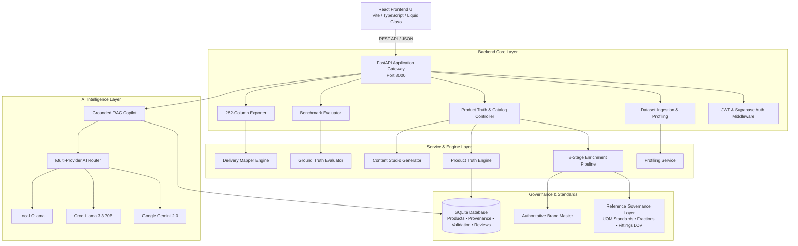

# ANVAYA Architecture Specification

## 1. System Overview

ANVAYA is structured as a decoupled, modular micro-architecture consisting of:
- **FastAPI Core Application Service**: High-throughput REST API managing routing, transactions, and pipeline dispatch.
- **Authoritative Reference Governance Layer**: In-memory rule catalog governing UOM standards, decimal-fraction conversions, brand dictionaries, and fittings LOVs.
- **Product Truth Engine**: Relational provenance layer recording the origin, method, rule, and confidence of every extracted attribute.
- **Multi-Provider AI Abstraction Layer**: Pluggable adapter layer providing unified access to Gemini, Groq, OpenRouter, and local Ollama instances.
- **Deterministic Content Synthesis Engine**: Rule-grounded text synthesis system enforcing strict character caps for eCommerce channels.
- **252-Column Delivery Mapper & Exporter**: Format engine transforming canonical database entities into standard delivery schemas.
- **React Liquid Glass Frontend**: Enterprise-grade UI with real-time KPI metrics, interactive fittings lab, decision trace inspector, and review queue.

---

## 2. Component Diagram

---

## 3. Database Schema Design

The SQLite/PostgreSQL schema is normalized across four primary entities:

1. **`products`**:
   - Stores raw ingested fields (`mfg_part_num`, `part_desc`, `part_manuf`, `e1_brand`, `unilog_brand`, `dib_brand`).
   - Stores canonical enriched fields (`cleaned_name`, `canonical_brand`, `category`, `subcategory`, `product_type`).
   - Dense JSON payload containers (`attributes_json`, `descriptions_json`).
   - Quality metrics (`completeness_score`, `confidence_score`, `validation_status`, `review_status`).

2. **`provenance_records`**:
   - Foreign key to `products.id` with cascade deletion.
   - Stores `field_name`, `value`, `source`, `evidence`, `method`, `confidence`, and `timestamp`.

3. **`validation_issues`**:
   - Tracks automated quality gate infractions (`field_name`, `rule_name`, `severity`, `message`, `is_resolved`).

4. **`review_items`**:
   - Queue items requiring human approval (`field_name`, `reason`, `current_value`, `suggested_value`, `status`, `reviewer_notes`).

5. **`audit_logs`**:
   - Immutable audit trail capturing every system event, user review decision, and batch ingestion.
